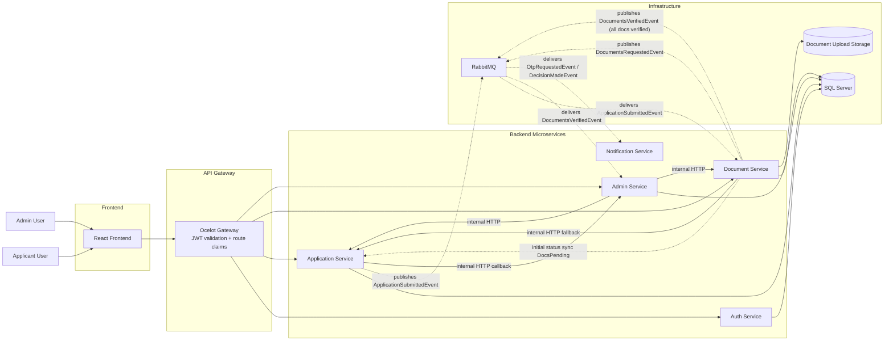
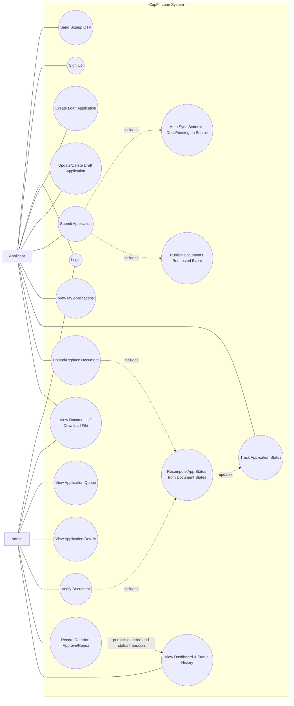
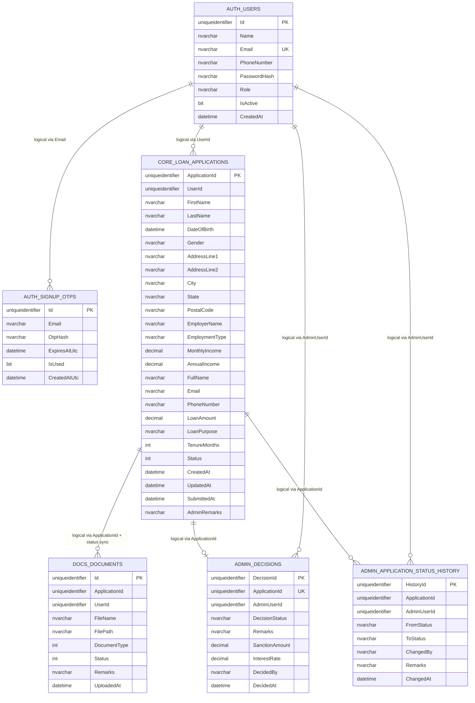

# CapFinLoan Diagrams

This document provides three Mermaid diagrams based on the current codebase and Docker setup.

## 1) Architecture Diagram

## 2) Use Case Diagram

## 3) Database EF Diagram (ER)

## Notes

- The relationships above are mostly logical cross-service links by ID, not enforced SQL foreign keys across databases.
- Data is split per service (`auth`, `core`, `docs`, `admin` schemas) with service-owned EF Core contexts.
- API access is mediated through the Ocelot gateway, with role-based authorization for admin routes.